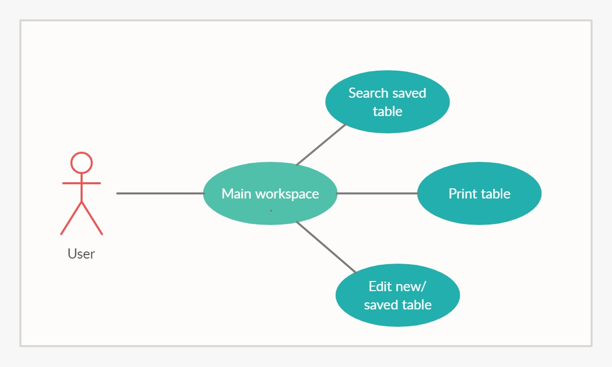

# Assignment 3

# Phase 1

## JADWAL DOT COM
Pernahkah anda kesulitan untuk membuat tabel jadwal kuliah? Kami juga berpendapat demikian. Maka dari itu, kami tergerak untuk menyelesaikan masalah ini dengan membuat website yang dapat membuat jadwal kuliah dengan praktis, yaitu JADWAL DOT COM.

## Use Case Diagram

## Features
1.  Tampilan yang sederhana.
2.  Fitur submit dan hapus data dari jadwal.
3.	Sistem penyimpan data jadwal berupa kode jadwal.
4.	Dengan memasukan kode jadwal di kotak pencarian, pengguna bisa langsung mendapatkan jadwal yang pernah dibuat sebelumnya.
5.	Dapat mencetak jadwal menjadi jpeg dan pdf.

## Planned Features 
1.  Format tabel yang bisa diubah, seperti format yang awalnya 7 hari 14 jam akademik menjadi 5 hari 14 jam akademik dan tiap satu jam akademik dapat diubah menjadi 30 menit.
2.  Desain hiasan pada tabel yang menarik.

## Mini Report
Berikut link untuk mini report: [mini report](mini-report.md)

# Phase 2
berikut link video presentasi kami: [video presentasi](https://youtu.be/MM-FzABsrAM)

# Academic Report
berikut link untuk academic report:

# Team K
1.  Nehemiah Austen Pison (1313619021)- [EzraelVio](https://github.com/EzraelVio)
2.  Ikhsan Agil Kusuma (1313619005)- [Ikhsan-Agil](https://github.com/Ikhsan-Agil)
3.  Muhammad Faris Al Husain (1313619020)- [FarisAlHusain20](https://github.com/FarisAlHusain20)

