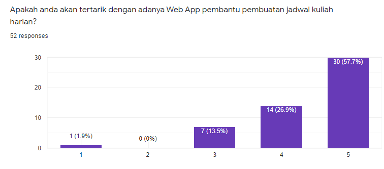

# Assignment 3

# Phase 1

## JADWAL DOT COM
Pernahkah anda kesulitan untuk membuat tabel jadwal kuliah? Kami juga berpendapat demikian. Maka dari itu, kami tergerak untuk menyelesaikan masalah ini dengan membuat website yang dapat membuat jadwal kuliah dengan praktis, yaitu JADWAL DOT COM.

## Survey form Questionnaires

## Use Case Diagram

## Features
1. Tampilan yang mudah dimengerti.
2. Dapat mengubah jadwal yang telah ditulis sebelumnya (cloudsave dengan key system).
3. Dapat mencetak jadwal menjadi bentuk jpeg dan pdf.

## Planned Features 
1. Format tabel yang bisa diubah.
2. Desain yang menarik.

# Phase 2
berikut link video presentasi kami: [video presentasi](https://youtu.be/MM-FzABsrAM)

# Academic Report
berikut link untuk academic report:

# Team K
1. Nehemiah Austen Pison (1313619021)- [EzraelVio](https://github.com/EzraelVio)
2. Ikhsan Agil Kusuma (1313619005)- [Ikhsan-Agil](https://github.com/Ikhsan-Agil)
3. Muhammad Faris Al Husain (1313619020)- [FarisAlHusain20](https://github.com/FarisAlHusain20)

