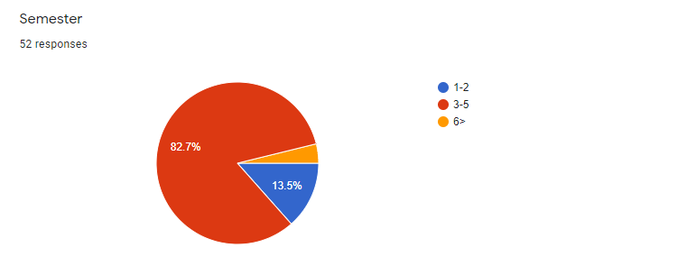
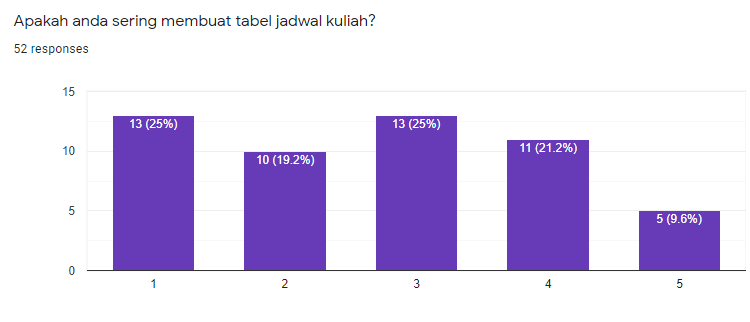
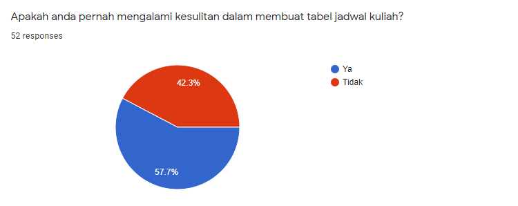
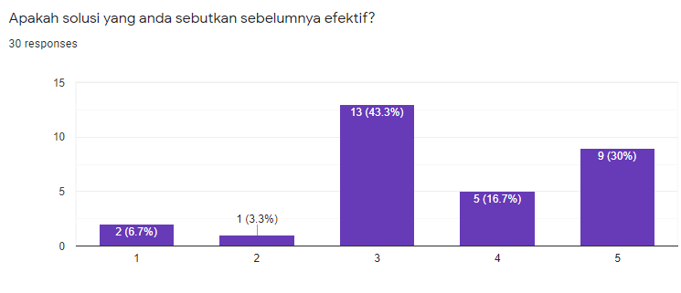
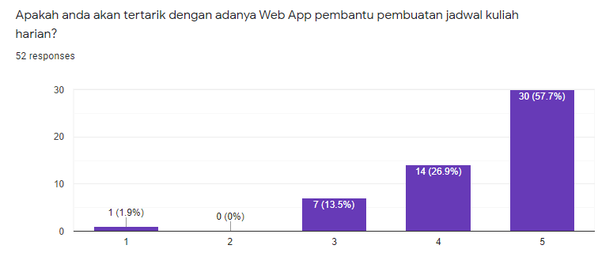

# Mini Report

Pada Assignment 3 ini, kelompok kami telah menentukan ide untuk website yang akan dibuat, yaitu sebuah builder jadwal berbasis web yang bernama Jadwal Dot Com. Ide ini muncul karena kami menghadapi sebuah kesulitan dalam menyusun jadwal kuliah yang tidak tetap. Setelah mendapat ide, kami pun membuat kuesioner untuk mendapatkan data dari responden tentang apa saja yang diperlukan website kami dan antusias responden terhadap website kami.
Website Jadwal Dot Com bersifat floating user karena kita mengambil responden tidak hanya dari satu universitas, melainkan dari beberapa universitas.

## Prolog Kuesioner 1
### Analisis Grafik 1

Pada grafik tersebut ditampilkan data tentang semester yang saat ini ditempuh oleh responden. Ternyata kebanyakan dari responden berada pada semester ketiga sampai dengan semester 5.

### Analisis Grafik 2

Pada grafik tersebut ditampilkan data tentang seberapa sering responden membuat jadwal kuliah. Berdasarkan grafik tersebut, banyak responden yang masih jarang membuat jadwal kuliah.

### Analisis Grafik 3

Pada grafik tersebut, dapat disimpulkan bahwa masih banyak yang kesulitan dalam membuat jadwal kuliah.

### Analisis Grafik 4

Pada grafik ini, kebanyakan responden menyatakan bahwa solusi yang mereka temukan dalam membuat jadwal kuliah ternyata tidak begitu efektif.

### Analisis Grafik 5

Pada grafik tersebut ditampilkan data tentang antusiasme responden terhadap ide kami. Antusias mereka sangat tinggi karena kebanyakan dari mereka menyatakan sangat terbantu dengan adanya website yang kami buat.

### Kesimpulan Analisis
Jadi, berdasarkan data-data yang ada dapat disimpulkan bahwa banyak responden yang masih kesulitan dalam membuat jadwal kuliah dan antusiasme mereka sangat tinggi terhadap website yang akan kami buat.

## Mock up Design
Link untuk melihat mock up design: [mock up design Team K](Dokumentasi/Mock Up Design Team K)

Alur mock up:
1.  User masuk ke website Jadwal Dot Com dan website langsung memperlihatkan cara pengisisan, kotak pengisian, pratinjau, dan beberapa tombol pengeditan. 
2.  Selanjutnya, user mengisi data yang diinginkan lalu data yang telah  dimasukan dapat diubah juga. 
3.  Setelah jadwal yang diinginkan telah selesai, pengguna  dapat mencetak jadwal nya langsung di website Jadwal Dot Com, website akan menghubungkan dengan printer yang tersedia untuk mencetak.

